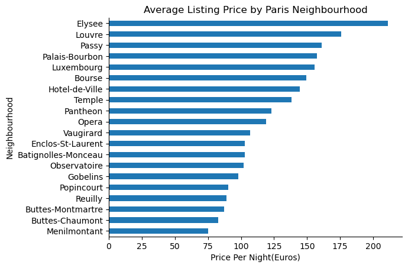
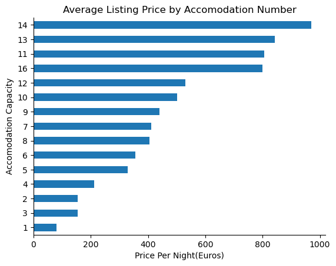
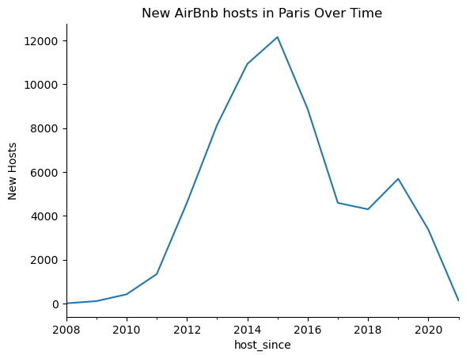
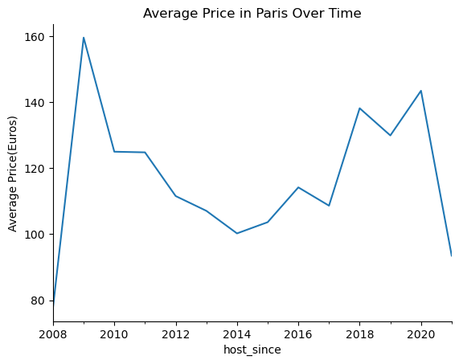
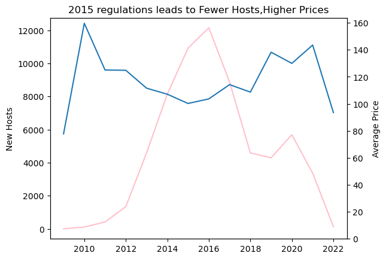

### AirBnb Listings Analysis

* Read in the AirBnb data
* Change data types accordingly,filter data as needed
* QA analysis as well


```python
import pandas as pd

listings = pd.read_csv(r'F:\Data\Python\Airrbnb\Listings.csv', 
                       encoding="ISO-8859-1", 
                       low_memory=False,
                       parse_dates= ["host_since"]
                      )
listings.head()
#listings["host_since"] = pd.to_datetime(listings["host_since"])
```


<div>
<style scoped>
    .dataframe tbody tr th:only-of-type {
        vertical-align: middle;
    }

    .dataframe tbody tr th {
        vertical-align: top;
    }

    .dataframe thead th {
        text-align: right;
    }
</style>
<table border="1" class="dataframe">
  <thead>
    <tr style="text-align: right;">
      <th></th>
      <th>listing_id</th>
      <th>name</th>
      <th>host_id</th>
      <th>host_since</th>
      <th>host_location</th>
      <th>host_response_time</th>
      <th>host_response_rate</th>
      <th>host_acceptance_rate</th>
      <th>host_is_superhost</th>
      <th>host_total_listings_count</th>
      <th>...</th>
      <th>minimum_nights</th>
      <th>maximum_nights</th>
      <th>review_scores_rating</th>
      <th>review_scores_accuracy</th>
      <th>review_scores_cleanliness</th>
      <th>review_scores_checkin</th>
      <th>review_scores_communication</th>
      <th>review_scores_location</th>
      <th>review_scores_value</th>
      <th>instant_bookable</th>
    </tr>
  </thead>
  <tbody>
    <tr>
      <th>0</th>
      <td>281420</td>
      <td>Beautiful Flat in le Village Montmartre, Paris</td>
      <td>1466919</td>
      <td>2011-12-03</td>
      <td>Paris, Ile-de-France, France</td>
      <td>NaN</td>
      <td>NaN</td>
      <td>NaN</td>
      <td>f</td>
      <td>1.0</td>
      <td>...</td>
      <td>2</td>
      <td>1125</td>
      <td>100.0</td>
      <td>10.0</td>
      <td>10.0</td>
      <td>10.0</td>
      <td>10.0</td>
      <td>10.0</td>
      <td>10.0</td>
      <td>f</td>
    </tr>
    <tr>
      <th>1</th>
      <td>3705183</td>
      <td>39 m² Paris (Sacre Cœur)</td>
      <td>10328771</td>
      <td>2013-11-29</td>
      <td>Paris, Ile-de-France, France</td>
      <td>NaN</td>
      <td>NaN</td>
      <td>NaN</td>
      <td>f</td>
      <td>1.0</td>
      <td>...</td>
      <td>2</td>
      <td>1125</td>
      <td>100.0</td>
      <td>10.0</td>
      <td>10.0</td>
      <td>10.0</td>
      <td>10.0</td>
      <td>10.0</td>
      <td>10.0</td>
      <td>f</td>
    </tr>
    <tr>
      <th>2</th>
      <td>4082273</td>
      <td>Lovely apartment with Terrace, 60m2</td>
      <td>19252768</td>
      <td>2014-07-31</td>
      <td>Paris, Ile-de-France, France</td>
      <td>NaN</td>
      <td>NaN</td>
      <td>NaN</td>
      <td>f</td>
      <td>1.0</td>
      <td>...</td>
      <td>2</td>
      <td>1125</td>
      <td>100.0</td>
      <td>10.0</td>
      <td>10.0</td>
      <td>10.0</td>
      <td>10.0</td>
      <td>10.0</td>
      <td>10.0</td>
      <td>f</td>
    </tr>
    <tr>
      <th>3</th>
      <td>4797344</td>
      <td>Cosy studio (close to Eiffel tower)</td>
      <td>10668311</td>
      <td>2013-12-17</td>
      <td>Paris, Ile-de-France, France</td>
      <td>NaN</td>
      <td>NaN</td>
      <td>NaN</td>
      <td>f</td>
      <td>1.0</td>
      <td>...</td>
      <td>2</td>
      <td>1125</td>
      <td>100.0</td>
      <td>10.0</td>
      <td>10.0</td>
      <td>10.0</td>
      <td>10.0</td>
      <td>10.0</td>
      <td>10.0</td>
      <td>f</td>
    </tr>
    <tr>
      <th>4</th>
      <td>4823489</td>
      <td>Close to Eiffel Tower - Beautiful flat : 2 rooms</td>
      <td>24837558</td>
      <td>2014-12-14</td>
      <td>Paris, Ile-de-France, France</td>
      <td>NaN</td>
      <td>NaN</td>
      <td>NaN</td>
      <td>f</td>
      <td>1.0</td>
      <td>...</td>
      <td>2</td>
      <td>1125</td>
      <td>100.0</td>
      <td>10.0</td>
      <td>10.0</td>
      <td>10.0</td>
      <td>10.0</td>
      <td>10.0</td>
      <td>10.0</td>
      <td>f</td>
    </tr>
  </tbody>
</table>
<p>5 rows × 33 columns</p>
</div>


```python
listings.info()
```

    <class 'pandas.core.frame.DataFrame'>
    RangeIndex: 279712 entries, 0 to 279711
    Data columns (total 33 columns):
     #   Column                       Non-Null Count   Dtype         
    ---  ------                       --------------   -----         
     0   listing_id                   279712 non-null  int64         
     1   name                         279537 non-null  object        
     2   host_id                      279712 non-null  int64         
     3   host_since                   279547 non-null  datetime64[ns]
     4   host_location                278872 non-null  object        
     5   host_response_time           150930 non-null  object        
     6   host_response_rate           150930 non-null  float64       
     7   host_acceptance_rate         166625 non-null  float64       
     8   host_is_superhost            279547 non-null  object        
     9   host_total_listings_count    279547 non-null  float64       
     10  host_has_profile_pic         279547 non-null  object        
     11  host_identity_verified       279547 non-null  object        
     12  neighbourhood                279712 non-null  object        
     13  district                     37012 non-null   object        
     14  city                         279712 non-null  object        
     15  latitude                     279712 non-null  float64       
     16  longitude                    279712 non-null  float64       
     17  property_type                279712 non-null  object        
     18  room_type                    279712 non-null  object        
     19  accommodates                 279712 non-null  int64         
     20  bedrooms                     250277 non-null  float64       
     21  amenities                    279712 non-null  object        
     22  price                        279712 non-null  int64         
     23  minimum_nights               279712 non-null  int64         
     24  maximum_nights               279712 non-null  int64         
     25  review_scores_rating         188307 non-null  float64       
     26  review_scores_accuracy       187999 non-null  float64       
     27  review_scores_cleanliness    188047 non-null  float64       
     28  review_scores_checkin        187941 non-null  float64       
     29  review_scores_communication  188025 non-null  float64       
     30  review_scores_location       187937 non-null  float64       
     31  review_scores_value          187927 non-null  float64       
     32  instant_bookable             279712 non-null  object        
    dtypes: datetime64[ns](1), float64(13), int64(6), object(13)
    memory usage: 70.4+ MB
    


```python
Paris_listings =(
                listings.query("city == 'Paris'")
                .loc[:,["host_since","neighbourhood","city","accommodates","price"]]
)
```


```python
Paris_listings.info()
```

    <class 'pandas.core.frame.DataFrame'>
    Index: 64690 entries, 0 to 279711
    Data columns (total 5 columns):
     #   Column         Non-Null Count  Dtype         
    ---  ------         --------------  -----         
     0   host_since     64657 non-null  datetime64[ns]
     1   neighbourhood  64690 non-null  object        
     2   city           64690 non-null  object        
     3   accommodates   64690 non-null  int64         
     4   price          64690 non-null  int64         
    dtypes: datetime64[ns](1), int64(2), object(2)
    memory usage: 3.0+ MB
    


```python
Paris_listings.isna().sum()
# df.dropna(inplace=True) here since it is very less compared to the total rows we neglect it.
```


    host_since       33
    neighbourhood     0
    city              0
    accommodates      0
    price             0
    dtype: int64


```python
Paris_listings[["accommodates","price"]].describe().round(2)
```


<div>
<style scoped>
    .dataframe tbody tr th:only-of-type {
        vertical-align: middle;
    }

    .dataframe tbody tr th {
        vertical-align: top;
    }

    .dataframe thead th {
        text-align: right;
    }
</style>
<table border="1" class="dataframe">
  <thead>
    <tr style="text-align: right;">
      <th></th>
      <th>accommodates</th>
      <th>price</th>
    </tr>
  </thead>
  <tbody>
    <tr>
      <th>count</th>
      <td>64690.00</td>
      <td>64690.00</td>
    </tr>
    <tr>
      <th>mean</th>
      <td>3.04</td>
      <td>113.10</td>
    </tr>
    <tr>
      <th>std</th>
      <td>1.59</td>
      <td>214.43</td>
    </tr>
    <tr>
      <th>min</th>
      <td>0.00</td>
      <td>0.00</td>
    </tr>
    <tr>
      <th>25%</th>
      <td>2.00</td>
      <td>59.00</td>
    </tr>
    <tr>
      <th>50%</th>
      <td>2.00</td>
      <td>80.00</td>
    </tr>
    <tr>
      <th>75%</th>
      <td>4.00</td>
      <td>120.00</td>
    </tr>
    <tr>
      <th>max</th>
      <td>16.00</td>
      <td>12000.00</td>
    </tr>
  </tbody>
</table>
</div>


```python
Paris_listings.query( "accommodates == 0 " and "price == 0" ).count()
```


    host_since       62
    neighbourhood    62
    city             62
    accommodates     62
    price            62
    dtype: int64


```python
Paris = Paris_listings.query("accommodates != 0 " or "price != 0")
```


```python
Paris.info()
```

    <class 'pandas.core.frame.DataFrame'>
    Index: 64636 entries, 0 to 279711
    Data columns (total 5 columns):
     #   Column         Non-Null Count  Dtype         
    ---  ------         --------------  -----         
     0   host_since     64603 non-null  datetime64[ns]
     1   neighbourhood  64636 non-null  object        
     2   city           64636 non-null  object        
     3   accommodates   64636 non-null  int64         
     4   price          64636 non-null  int64         
    dtypes: datetime64[ns](1), int64(2), object(2)
    memory usage: 3.0+ MB
    


```python
Paris_lis = Paris.query("price != 0")
```


```python
Paris_lis.info()
```

    <class 'pandas.core.frame.DataFrame'>
    Index: 64628 entries, 0 to 279711
    Data columns (total 5 columns):
     #   Column         Non-Null Count  Dtype         
    ---  ------         --------------  -----         
     0   host_since     64595 non-null  datetime64[ns]
     1   neighbourhood  64628 non-null  object        
     2   city           64628 non-null  object        
     3   accommodates   64628 non-null  int64         
     4   price          64628 non-null  int64         
    dtypes: datetime64[ns](1), int64(2), object(2)
    memory usage: 3.0+ MB
    


```python
Paris_lis
```


<div>
<style scoped>
    .dataframe tbody tr th:only-of-type {
        vertical-align: middle;
    }

    .dataframe tbody tr th {
        vertical-align: top;
    }

    .dataframe thead th {
        text-align: right;
    }
</style>
<table border="1" class="dataframe">
  <thead>
    <tr style="text-align: right;">
      <th></th>
      <th>host_since</th>
      <th>neighbourhood</th>
      <th>city</th>
      <th>accommodates</th>
      <th>price</th>
    </tr>
  </thead>
  <tbody>
    <tr>
      <th>0</th>
      <td>2011-12-03</td>
      <td>Buttes-Montmartre</td>
      <td>Paris</td>
      <td>2</td>
      <td>53</td>
    </tr>
    <tr>
      <th>1</th>
      <td>2013-11-29</td>
      <td>Buttes-Montmartre</td>
      <td>Paris</td>
      <td>2</td>
      <td>120</td>
    </tr>
    <tr>
      <th>2</th>
      <td>2014-07-31</td>
      <td>Elysee</td>
      <td>Paris</td>
      <td>2</td>
      <td>89</td>
    </tr>
    <tr>
      <th>3</th>
      <td>2013-12-17</td>
      <td>Vaugirard</td>
      <td>Paris</td>
      <td>2</td>
      <td>58</td>
    </tr>
    <tr>
      <th>4</th>
      <td>2014-12-14</td>
      <td>Passy</td>
      <td>Paris</td>
      <td>2</td>
      <td>60</td>
    </tr>
    <tr>
      <th>...</th>
      <td>...</td>
      <td>...</td>
      <td>...</td>
      <td>...</td>
      <td>...</td>
    </tr>
    <tr>
      <th>279707</th>
      <td>2015-04-13</td>
      <td>Observatoire</td>
      <td>Paris</td>
      <td>2</td>
      <td>120</td>
    </tr>
    <tr>
      <th>279708</th>
      <td>2013-11-27</td>
      <td>Buttes-Montmartre</td>
      <td>Paris</td>
      <td>2</td>
      <td>60</td>
    </tr>
    <tr>
      <th>279709</th>
      <td>2012-04-27</td>
      <td>Buttes-Montmartre</td>
      <td>Paris</td>
      <td>2</td>
      <td>50</td>
    </tr>
    <tr>
      <th>279710</th>
      <td>2015-07-16</td>
      <td>Popincourt</td>
      <td>Paris</td>
      <td>2</td>
      <td>105</td>
    </tr>
    <tr>
      <th>279711</th>
      <td>2013-06-17</td>
      <td>Enclos-St-Laurent</td>
      <td>Paris</td>
      <td>2</td>
      <td>70</td>
    </tr>
  </tbody>
</table>
<p>64628 rows × 5 columns</p>
</div>


```python
Paris_lis[["accommodates","price"]].describe().round(2)
```


<div>
<style scoped>
    .dataframe tbody tr th:only-of-type {
        vertical-align: middle;
    }

    .dataframe tbody tr th {
        vertical-align: top;
    }

    .dataframe thead th {
        text-align: right;
    }
</style>
<table border="1" class="dataframe">
  <thead>
    <tr style="text-align: right;">
      <th></th>
      <th>accommodates</th>
      <th>price</th>
    </tr>
  </thead>
  <tbody>
    <tr>
      <th>count</th>
      <td>64628.00</td>
      <td>64628.00</td>
    </tr>
    <tr>
      <th>mean</th>
      <td>3.04</td>
      <td>113.20</td>
    </tr>
    <tr>
      <th>std</th>
      <td>1.59</td>
      <td>214.51</td>
    </tr>
    <tr>
      <th>min</th>
      <td>1.00</td>
      <td>8.00</td>
    </tr>
    <tr>
      <th>25%</th>
      <td>2.00</td>
      <td>59.00</td>
    </tr>
    <tr>
      <th>50%</th>
      <td>2.00</td>
      <td>80.00</td>
    </tr>
    <tr>
      <th>75%</th>
      <td>4.00</td>
      <td>120.00</td>
    </tr>
    <tr>
      <th>max</th>
      <td>16.00</td>
      <td>12000.00</td>
    </tr>
  </tbody>
</table>
</div>


```python
paris_listings_neighbourhood = (
                                Paris_lis[["neighbourhood","price"]]
                                .groupby("neighbourhood")
                                .mean("Price")
                                .sort_values(by = "price")
                                .round(2)
)
    #agg{"price":["mean",max]}                           
```


```python
paris_listings_neighbourhood
```


<div>
<style scoped>
    .dataframe tbody tr th:only-of-type {
        vertical-align: middle;
    }

    .dataframe tbody tr th {
        vertical-align: top;
    }

    .dataframe thead th {
        text-align: right;
    }
</style>
<table border="1" class="dataframe">
  <thead>
    <tr style="text-align: right;">
      <th></th>
      <th>price</th>
    </tr>
    <tr>
      <th>neighbourhood</th>
      <th></th>
    </tr>
  </thead>
  <tbody>
    <tr>
      <th>Menilmontant</th>
      <td>74.96</td>
    </tr>
    <tr>
      <th>Buttes-Chaumont</th>
      <td>82.69</td>
    </tr>
    <tr>
      <th>Buttes-Montmartre</th>
      <td>87.23</td>
    </tr>
    <tr>
      <th>Reuilly</th>
      <td>89.13</td>
    </tr>
    <tr>
      <th>Popincourt</th>
      <td>90.59</td>
    </tr>
    <tr>
      <th>Gobelins</th>
      <td>98.11</td>
    </tr>
    <tr>
      <th>Observatoire</th>
      <td>101.99</td>
    </tr>
    <tr>
      <th>Batignolles-Monceau</th>
      <td>102.68</td>
    </tr>
    <tr>
      <th>Enclos-St-Laurent</th>
      <td>103.10</td>
    </tr>
    <tr>
      <th>Vaugirard</th>
      <td>107.08</td>
    </tr>
    <tr>
      <th>Opera</th>
      <td>119.19</td>
    </tr>
    <tr>
      <th>Pantheon</th>
      <td>122.95</td>
    </tr>
    <tr>
      <th>Temple</th>
      <td>138.45</td>
    </tr>
    <tr>
      <th>Hotel-de-Ville</th>
      <td>144.47</td>
    </tr>
    <tr>
      <th>Bourse</th>
      <td>149.63</td>
    </tr>
    <tr>
      <th>Luxembourg</th>
      <td>155.79</td>
    </tr>
    <tr>
      <th>Palais-Bourbon</th>
      <td>157.48</td>
    </tr>
    <tr>
      <th>Passy</th>
      <td>161.24</td>
    </tr>
    <tr>
      <th>Louvre</th>
      <td>175.75</td>
    </tr>
    <tr>
      <th>Elysee</th>
      <td>211.37</td>
    </tr>
  </tbody>
</table>
</div>


```python
paris_listings_accomodate = (
                                Paris_lis
                                .query("neighbourhood == 'Elysee'" )
                                .groupby("accommodates")
                                .agg({"price":"mean"})
                                .sort_values(by = "price")
                                .round(2)
)
```


```python
paris_listings_accomodate
```


<div>
<style scoped>
    .dataframe tbody tr th:only-of-type {
        vertical-align: middle;
    }

    .dataframe tbody tr th {
        vertical-align: top;
    }

    .dataframe thead th {
        text-align: right;
    }
</style>
<table border="1" class="dataframe">
  <thead>
    <tr style="text-align: right;">
      <th></th>
      <th>price</th>
    </tr>
    <tr>
      <th>accommodates</th>
      <th></th>
    </tr>
  </thead>
  <tbody>
    <tr>
      <th>1</th>
      <td>79.52</td>
    </tr>
    <tr>
      <th>3</th>
      <td>153.88</td>
    </tr>
    <tr>
      <th>2</th>
      <td>155.10</td>
    </tr>
    <tr>
      <th>4</th>
      <td>212.10</td>
    </tr>
    <tr>
      <th>5</th>
      <td>328.82</td>
    </tr>
    <tr>
      <th>6</th>
      <td>355.51</td>
    </tr>
    <tr>
      <th>8</th>
      <td>405.52</td>
    </tr>
    <tr>
      <th>7</th>
      <td>411.54</td>
    </tr>
    <tr>
      <th>9</th>
      <td>440.27</td>
    </tr>
    <tr>
      <th>10</th>
      <td>500.86</td>
    </tr>
    <tr>
      <th>12</th>
      <td>529.62</td>
    </tr>
    <tr>
      <th>16</th>
      <td>800.00</td>
    </tr>
    <tr>
      <th>11</th>
      <td>805.00</td>
    </tr>
    <tr>
      <th>13</th>
      <td>842.50</td>
    </tr>
    <tr>
      <th>14</th>
      <td>971.00</td>
    </tr>
  </tbody>
</table>
</div>


```python
paris_listings_over_time = (
                            Paris_lis
                            .set_index("host_since")
                            .resample("YE")
                            .agg({"neighbourhood":"count","price":"mean"})
                            .round(2)
    )
    
```


```python
paris_listings_over_time
```


<div>
<style scoped>
    .dataframe tbody tr th:only-of-type {
        vertical-align: middle;
    }

    .dataframe tbody tr th {
        vertical-align: top;
    }

    .dataframe thead th {
        text-align: right;
    }
</style>
<table border="1" class="dataframe">
  <thead>
    <tr style="text-align: right;">
      <th></th>
      <th>neighbourhood</th>
      <th>price</th>
    </tr>
    <tr>
      <th>host_since</th>
      <th></th>
      <th></th>
    </tr>
  </thead>
  <tbody>
    <tr>
      <th>2008-12-31</th>
      <td>4</td>
      <td>77.75</td>
    </tr>
    <tr>
      <th>2009-12-31</th>
      <td>106</td>
      <td>159.64</td>
    </tr>
    <tr>
      <th>2010-12-31</th>
      <td>416</td>
      <td>125.03</td>
    </tr>
    <tr>
      <th>2011-12-31</th>
      <td>1339</td>
      <td>124.83</td>
    </tr>
    <tr>
      <th>2012-12-31</th>
      <td>4592</td>
      <td>111.58</td>
    </tr>
    <tr>
      <th>2013-12-31</th>
      <td>8142</td>
      <td>107.10</td>
    </tr>
    <tr>
      <th>2014-12-31</th>
      <td>10922</td>
      <td>100.25</td>
    </tr>
    <tr>
      <th>2015-12-31</th>
      <td>12147</td>
      <td>103.65</td>
    </tr>
    <tr>
      <th>2016-12-31</th>
      <td>8867</td>
      <td>114.21</td>
    </tr>
    <tr>
      <th>2017-12-31</th>
      <td>4585</td>
      <td>108.66</td>
    </tr>
    <tr>
      <th>2018-12-31</th>
      <td>4294</td>
      <td>138.21</td>
    </tr>
    <tr>
      <th>2019-12-31</th>
      <td>5685</td>
      <td>129.96</td>
    </tr>
    <tr>
      <th>2020-12-31</th>
      <td>3363</td>
      <td>143.52</td>
    </tr>
    <tr>
      <th>2021-12-31</th>
      <td>133</td>
      <td>93.49</td>
    </tr>
  </tbody>
</table>
</div>


### Visualizations


```python
import seaborn as sbn

(paris_listings_neighbourhood
 .plot
 .barh(
        title="Average Listing Price by Paris Neighbourhood",
        xlabel="Price Per Night(Euros)",
        ylabel="Neighbourhood",
        legend=None
    )
)

sbn.despine()
```


    

    


```python
(paris_listings_accomodate
 .plot
 .barh(
       title="Average Listing Price by Accomodation Number",
       xlabel="Price Per Night(Euros)",
       ylabel="Accomodation Capacity",
       legend=None
 )
)
sbn.despine()
```


    

    


```python
(paris_listings_over_time["neighbourhood"]
 .plot(
        title="New AirBnb hosts in Paris Over Time",
        ylabel="New Hosts")
)

sbn.despine()
```


    

    


```python
(paris_listings_over_time["price"]
 .plot(
        title="Average Price in Paris Over Time",
        ylabel="Average Price(Euros)"
 )
)
sbn.despine()
```


    

    


```python
import matplotlib.pyplot as plt

fig, ax =plt.subplots()

ax.plot(
          paris_listings_over_time.index,    
          paris_listings_over_time["neighbourhood"],
          c="pink"       
           )
ax.set_ylabel("New Hosts")

ax2 = ax.twinx()

ax2.plot(
          paris_listings_over_time.index,
          paris_listings_over_time["price"]
          )
ax2.set_ylim(0)
ax2.set_ylabel("Average Price")
ax.set_title("2015 regulations leads to Fewer Hosts,Higher Prices")
plt.show()

```


    

    


```python

```
